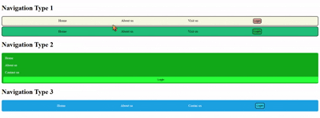

# 🍔 JavaScript Practice – Food Selector

This is a **simple JavaScript practice project** that allows users to select food items from a list and perform actions like adding to a **Wishlist** or **Cart**. The goal was to explore **DOM manipulation**, **event handling**, and basic **UI interactivity** using **HTML**, **Tailwind CSS**, and **Vanilla JavaScript**.

---

## ✅ Features

- Interactive food item list (e.g., Pizza, Burger, Pasta, etc.)
- Click an item to populate the input field.
- Click **Wishlist** or **Cart** to simulate adding the selected item.
- Alerts are triggered based on the chosen item.
- Responsive layout with hover effects and transitions.

---
## 📸 Preview

---

## 🧠 Skills Practiced

- `querySelectorAll()` and `Array.from()`
- Handling click events with `addEventListener()`
- Reading and updating input fields using `.value`
- Using `includes()` for simple validation
- Basic styling with **Tailwind CSS**

---

## 💻 How to Run

1. Clone or download the project.
2. Open `index.html` in any modern browser.
3. Click on a food item.
4. Click the **Wishlist** or **Cart** button to interact with it.

---

## 🛠 Tech Stack

- **HTML5**
- **Tailwind CSS**
- **JavaScript (ES6)**

---

## 📌 Note

This is a **practice project** built to improve core JavaScript skills. It focuses on clean logic, event-driven interaction, and basic styling without external libraries or frameworks.

